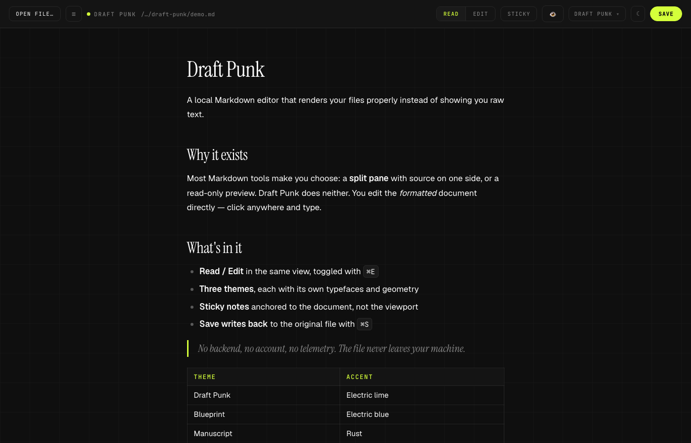

# Draft Punk

A local Markdown viewer and editor. Opens any `.md` file on your disk and shows it
properly formatted, with editing and save-to-disk. No dependencies — stdlib Python
plus one HTML file. Your file is read and written locally and never sent anywhere.



## Try it without installing anything

**[compounding-marketer.github.io/draft-punk](https://compounding-marketer.github.io/draft-punk/)**

Opens in the browser, reads and writes files on your own disk, nothing to download.
Chrome, Edge, Arc, and Brave can save back to the original file; Safari and Firefox
open it read-only and download a copy on save.

## Getting started

The **browser build works anywhere** — use the link above, or download
`share/draft-punk.html` and open it locally. No server, no Python, no install.

The **server build** needs Python 3 (already present on macOS and most Linux
distros). The `.app` bundle for Finder integration is macOS-only.

```bash
git clone https://github.com/compounding-marketer/draft-punk.git
cd draft-punk
./"Draft Punk.command"
```

That starts the local server and opens the editor in your browser. Or just open
`share/draft-punk.html` directly in Chrome for the no-server version.

### Use it as a Claude Code skill

Clone it into your skills directory and Claude will open Markdown files here
instead of dumping raw text into the terminal:

```bash
git clone https://github.com/compounding-marketer/draft-punk.git \
  ~/.claude/skills/draft-punk
```

Then ask Claude to "open this in Draft Punk". See `SKILL.md` for the HTTP API
if you want to read or write Markdown programmatically.

## Opening a file

Any of these work. The first two are the easy ones.

1. **Drag the file onto the editor window.** A "Drop to open" overlay appears;
   let go and it loads formatted. Saving writes back to the original file.
2. **Click `Open File…`** (or press `⌘O`) for the standard macOS open dialog.
   Reaches any folder, including Downloads.
3. **Double-click the file in Finder** — see *Making it the default app* below.
4. **☰ panel** — paste a full path (`⌥⌘C` copies one in Finder), pick from
   **Recent**, or click through folders in **Browse**.

> Dragging a `.md` file onto a plain browser window shows raw unformatted text,
> because the browser is displaying the file itself. Drop it onto the **editor
> window** instead and you get the formatted view.

## Two views, same document

Toggle in the top right, or press `⌘E`:

- **Read** — the formatted document.
- **Edit** — the *same* formatted document, now editable in place. Click anywhere
  and type. A formatting toolbar appears above it.

There is no raw-Markdown pane. You edit the formatted view directly and the file
is written back as clean Markdown.

### While editing

- **Toolbar**: headings, bold, italic, strikethrough, inline code, lists, quote,
  code block, link, divider.
- **`⌘B`** bold, **`⌘I`** italic, **`⌘K`** link.
- **Type Markdown as you go**: `# ` at the start of a line becomes a heading,
  `- ` starts a bullet list, `1. ` a numbered list, `> ` a quote.
- **Pasting** always comes in as plain text, so nothing from a web page can
  bring unsupported markup with it.

## Saving

- **`⌘S`** or the Save button writes the file back as Markdown.
- An orange dot in the header means unsaved changes.
- If nothing changed, Save does nothing — an untouched file is never rewritten.
- Files opened by drag-and-drop or the native dialog save through the browser's
  own file handle, so macOS folder permissions can't block a write.

The formatted view is converted back to Markdown on save. That conversion was
checked against 120 real Markdown files on this Mac and every one round-tripped to
an identical document. Two cosmetic normalisations happen: a paragraph that was
soft-wrapped across several source lines comes back as one line, and nested-list
indentation becomes two spaces. Both render identically.

## Where the app lives, and launching it

`Draft Punk.app` finds `server.py` **next to itself**, so keep the two together in
the project folder. Double-clicking the app, or dropping a `.md` file onto it,
starts the server and opens the editor.

Because the app is unsigned, macOS quarantines it on first launch after download.
Right-click it → **Open** → **Open** once, and it runs normally from then on.

To reach it from Spotlight or the Dock without moving it, make an alias rather
than a copy — right-click the app → **Make Alias**, then drag the alias wherever
you like. A moved *copy* loses track of `server.py`; an alias doesn't.

Editing `index.html` changes the app immediately — just reload the window. If you
change `server.py`, restart the server.

**From the terminal**, optionally install the `mdedit` command so you can open a
file from anywhere:

```bash
sudo ln -sf "$PWD/mdedit" /usr/local/bin/mdedit
```

Then `mdedit notes.md`, or `mdedit` on its own for the file picker. If you'd rather
not use `sudo`, symlink it into any directory already on your `PATH`.

## Making it the default app for .md files

So double-clicking any Markdown file in Finder opens it here:

1. Right-click any `.md` file in Finder → **Get Info**
2. Under **Open with**, choose **Draft Punk**
3. Click **Change All…**

To try it once without changing the default, right-click the file →
**Open With** → **Draft Punk**.

## Themes

Pick one from the **dropdown** in the header. Each is a complete identity — its own
typefaces, colours, corner geometry, and background — not just a recolour.

| Theme | Feel | Type | Accent |
|---|---|---|---|
| **Draft Punk** | The house look. Editorial, flat, 60px grid. | Instrument Serif + Geist + JetBrains Mono | Electric lime `#D4FF3A` |
| **Blueprint** | Technical and bold. Squared corners, 1.5px rules, tight 24px graph-paper grid. | Space Grotesk 700 + Inter + IBM Plex Mono | Electric blue `#2B4CFF` |
| **Manuscript** | A page, not a screen. Serif body, looser leading, narrower measure, no grid. | Fraunces + Source Serif 4 | Rust `#B4531F` |

**Dark and light are separate** from the theme. The **☾ / ☀ button** flips modes
within whichever theme you're in, so there are six looks in total. Both choices are
remembered; the first run follows your macOS appearance setting.

**On readability:** all six theme-and-mode combinations were measured, and every
text-on-background pair clears WCAG AA (4.5:1) — the worst pair across the whole set
is 4.64:1. Accents that are too bright to use as text in light mode (lime, for one)
darken automatically while staying bright for decorative use.

## Sticky notes

Press **⌘J** or the **Sticky** button to drop a note onto the page. Notes are
**anchored to the document, not the window** — put one beside a paragraph and it
stays beside that paragraph as you scroll. Drag by the top strip, resize from the
bottom-right corner. A new note appears wherever you're currently reading.

- **Five colours** drawn from the theme, each with its own light and dark version.
  Click a dot in the note's strip to recolour it.
- **✎ scribbles** — click the pen to draw freehand on a note. Handy for arrows,
  circling a paragraph, or a quick diagram. **⌫** clears the scribble, **✕** deletes
  the note. Strokes scale when you resize, and re-ink themselves when you change colour.
- **👁 hides them all** when you just want to read, without deleting anything.

Notes belong to the document they were made on: open a different file and you get
that file's notes. They're stored in `stickies.json` in this folder — deliberately
*not* beside your files, so nothing stray is ever left in your own folders.

## Notes

- The server binds to `127.0.0.1` only, so it is not reachable from your network,
  and it rejects requests that don't arrive via `localhost`.
- Only `.md`, `.markdown`, `.mdx`, and `.txt` files can be opened or written.
  Anything else is refused, so the editor can't touch your other files.
- Symlinks resolve to their target, so opening a linked file edits the real one.
- Port is `8787`. Logs go to `server.log` in this folder.
- Brand fonts load from Google Fonts. Offline, the app falls back to system serif,
  sans, and mono — everything still works, it just looks less like the brand.

## Stopping the server

Kills whatever is listening on the port, however it was launched:

```bash
kill $(lsof -ti tcp:8787)
```
